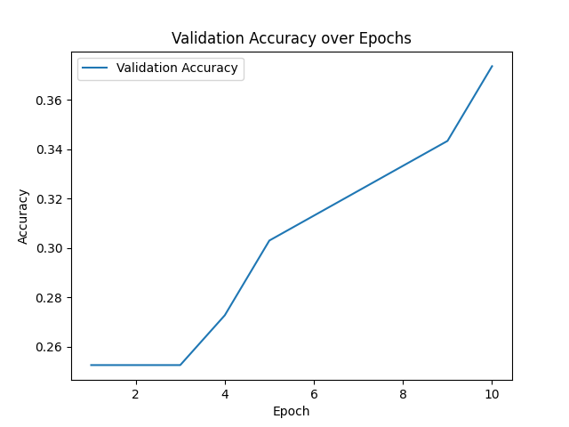
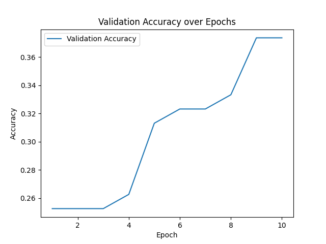

# Assignment3-Neural-topic-classification-for-Simplified-Chinese

# Neural Topic Classification for Simplified Chinese

A pipeline for multiclass topic classification of Simplified Chinese sentences
using FastText character embeddings and a feed-forward PyTorch classifier.

## Project Structure

```
Neural-topic-classification-for-Simplified-Chinese/
├── data/
│   ├── train.tsv
│   ├── dev.tsv
│   ├── test.tsv
│   └── labels.txt
├── embeddings/
│   ├── fasttext.model
│   ├── train_embeddings.npz
│   ├── dev_embeddings.npz
│   ├── test_embeddings.npz
│   ├── train_embeddings_sif.npz
│   ├── dev_embeddings_sif.npz
│   └── test_embeddings_sif.npz
├── models/
│   ├── classifier.pt
│   └── classifier_sif.pt
├── scripts/
│   ├── train_fasttext.py
│   ├── sentence_embeddings.py
│   ├── train_classifier.py
│   └── evaluate.py
├── training_plot_plain.png
├── training_plot_sif.png
└── README.md
```

## Requirements

Tested on Python 3.12 in a virtual environment on `mltgpu`.

```bash
pip install pandas numpy gensim torch scikit-learn matplotlib
```

## Design Decisions

**Character-level tokenization**: For Simplified Chinese, each character is
treated as a token. This sidesteps the need for a word segmentation tool and
is a reasonable approximation for short Wikipedia sentences.

**Latin characters and punctuation**: Characters outside the Chinese Unicode
range (e.g. Latin letters, digits, punctuation) are included as-is. FastText
generates subword embeddings for all characters, so they receive a vector
regardless of whether they were seen during training.

**SIF weighting**: When `--use_sif` is passed to `sentence_embeddings.py`,
character vectors are weighted by `a / (a + p)` where `p` is the character's
relative frequency in the input file and `a = 1e-3`. The first principal
component is then subtracted from all sentence vectors using TruncatedSVD.
Note: frequencies are computed from whichever files are passed via
`--input_files`, so for a faithful SIF implementation you should pass the
training data when computing embeddings for all splits (see Known Limitations).

---

## How to Run

All scripts should be run from the project root directory with the virtual
environment activated:

```bash
source assignment3ML/bin/activate
```

### Step 1 — Train FastText embeddings

Train character-level FastText embeddings on all splits:

```bash
python scripts/train_fasttext.py \
  --input_files data/train.tsv data/dev.tsv data/test.tsv \
  --embedding_dim 100 \
  --epochs 5 \
  --output_file embeddings/fasttext.model
```

| Argument | Description |
|---|---|
| `--input_files` | One or more `.tsv` files to train on |
| `--embedding_dim` | Dimensionality of the embeddings (default: 100) |
| `--epochs` | Training epochs (default: 5) |
| `--output_file` | Path to save the Gensim FastText model |

---

### Step 2 — Compute sentence embeddings

Average character embeddings into sentence vectors for each split:

```bash
python scripts/sentence_embeddings.py \
  --input_files data/train.tsv \
  --fasttext_model embeddings/fasttext.model \
  --output_file embeddings/train_embeddings.npz

python scripts/sentence_embeddings.py \
  --input_files data/dev.tsv \
  --fasttext_model embeddings/fasttext.model \
  --output_file embeddings/dev_embeddings.npz

python scripts/sentence_embeddings.py \
  --input_files data/test.tsv \
  --fasttext_model embeddings/fasttext.model \
  --output_file embeddings/test_embeddings.npz
```

Add `--use_sif` to use SIF-weighted averaging instead (see Bonus 2):

```bash
python scripts/sentence_embeddings.py \
  --input_files data/train.tsv \
  --fasttext_model embeddings/fasttext.model \
  --output_file embeddings/train_embeddings_sif.npz \
  --use_sif
```

| Argument | Description |
|---|---|
| `--input_files` | TSV file(s) to embed |
| `--fasttext_model` | Path to trained FastText model |
| `--output_file` | Output `.npz` file (contains `embeddings` and `labels` arrays) |
| `--use_sif` | Enable SIF weighting and principal component removal |

---

### Step 3 — Train the classifier

```bash
python scripts/train_classifier.py \
  --embeddings_file embeddings/train_embeddings.npz \
  --val_embeddings_file embeddings/dev_embeddings.npz \
  --epochs 10 \
  --batch_size 32 \
  --hidden_dim 128 \
  --output_model models/classifier.pt \
  --plot_file training_plot_plain.png
```

| Argument | Description |
|---|---|
| `--embeddings_file` | Path to training `.npz` embeddings file |
| `--val_embeddings_file` | (Optional) Validation `.npz` file — enables Bonus 1 accuracy tracking |
| `--epochs` | Number of training epochs (default: 10) |
| `--batch_size` | Batch size (default: 32) |
| `--hidden_dim` | Hidden layer size (default: 128) |
| `--output_model` | Path to save the trained model |
| `--plot_file` | Path to save the validation accuracy plot (default: `training_plot.png`) |

The model is a three-layer feed-forward network:
`Linear(input → hidden) → ReLU → Linear(hidden → hidden/2) → ReLU → Linear(hidden/2 → num_classes)`

Loss function: cross-entropy. Optimizer: Adam.

---

### Step 4 — Evaluate

```bash
python scripts/evaluate.py \
  --embeddings_file embeddings/test_embeddings.npz \
  --model_file models/classifier.pt
```

| Argument | Description |
|---|---|
| `--embeddings_file` | Path to test `.npz` embeddings file |
| `--model_file` | Path to trained `.pt` model |

---

## Results

### Plain averaging

| Metric | Value |
|---|---|
| Test accuracy | 31.86% |
| Chance baseline (1/7) | 14.29% |

The model achieves more than double the chance baseline, confirming that it
has learned something meaningful from the data rather than defaulting to
random or majority-class guessing.

**Confusion matrix:**
[[ 0  0  0  4 15  0  0]
[ 0  0  0  8  7  2  0]
[ 0  0  0  7 15  0  0]
[ 0  0  0 17 11  2  0]
[ 0  0  0  6 44  1  0]
[ 0  0  0 13  8  4  0]
[ 0  0  0  8 32  0  0]]

**Validation accuracy over training epochs:**



---

### SIF embeddings (Bonus 2)

| Metric | Value |
|---|---|
| Test accuracy | 31.37% |
| Chance baseline (1/7) | 14.29% |

**Confusion matrix:**
[[ 0  0  0  5 13  0  1]
[ 0  0  0 10  7  0  0]
[ 0  0  0  5 16  0  1]
[ 0  0  0 19  8  0  3]
[ 0  0  0  8 43  0  0]
[ 0  0  0 18  6  0  1]
[ 0  0  0  9 29  0  2]]

**Validation accuracy over training epochs:**



---

## Observations on the Confusion Matrix

The most striking pattern in both matrices is that columns 1, 2, and 3 (the
first three classes) are entirely zero — the model never predicts those
classes. Nearly all predictions land on class 4 or class 5, with class 5
attracting the majority of predictions across all true classes. This suggests
the model has collapsed into predicting only the most frequent or most
separable classes, likely because the character embeddings trained on a small
corpus (701 training sentences) do not provide enough discriminating signal to
distinguish all seven topics reliably.

The SIF model shows a marginally more spread distribution — a small number of
predictions reach class 7 that the plain model never predicted. Despite this,
test accuracy is slightly lower (31.37% vs 31.86%), which is consistent with
the known limitation that SIF frequencies were computed per-split rather than
from the full training corpus.

Both models comfortably exceed the chance baseline of 14.29%, confirming that
the training process is working correctly and the embeddings carry real
topical signal. The main bottleneck is the small dataset size and the
relatively coarse character-level representation.

---

## Known Limitations

- **SIF frequency computation**: Ideally, character frequencies for SIF
  weighting should be derived from the full training corpus and reused when
  embedding dev and test splits. In the current implementation, frequencies
  are computed from whichever files are passed to `--input_files`, meaning
  dev and test embeddings use their own per-split frequencies. This is a
  known approximation.

- **CUDA warning**: The GPU driver on `mltgpu` is older than the PyTorch
  version expects. The model falls back to CPU automatically with no effect
  on correctness.
